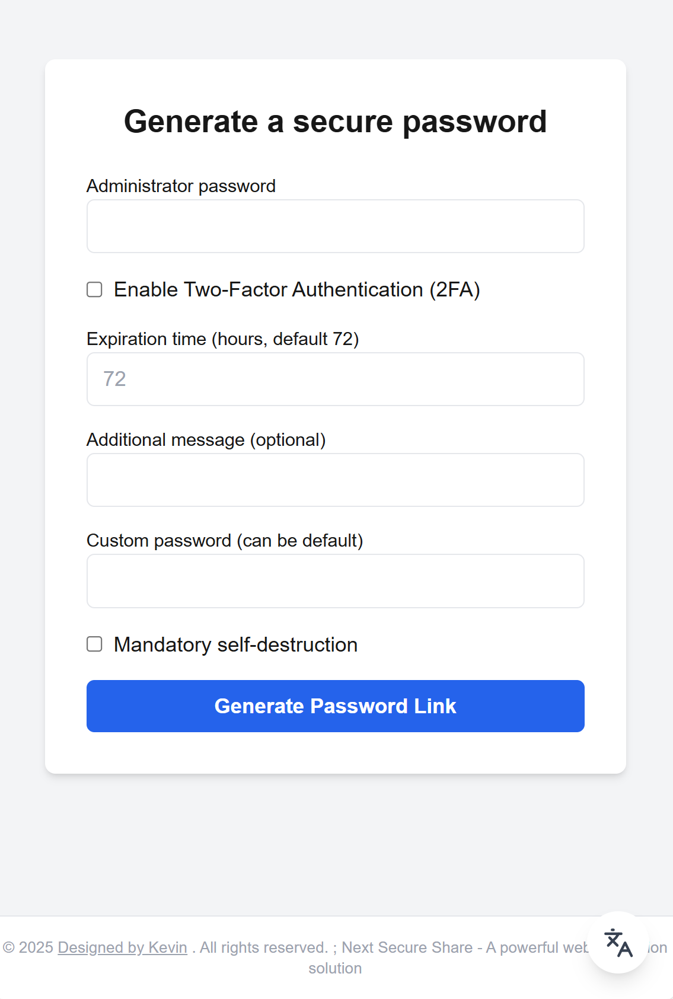
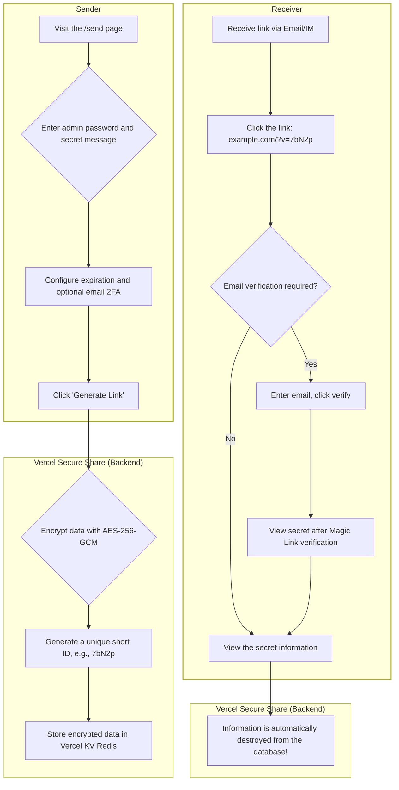
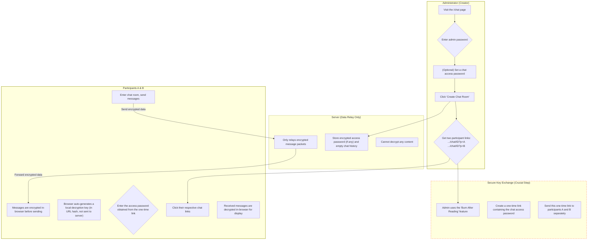

# Next Secure Share

A secure communication platform that integrates **one-time secret sharing** and **simple end-to-end encrypted chat**. Using "burn-after-reading" links and in-browser encryption, it ensures your sensitive information is destroyed immediately after being delivered or remains encrypted throughout a private session.

[](#quick-start-one-click-deploy-to-vercel)

[](https://github.com/infrost/next-secure-share/blob/main/README.md)



---

## Why Choose Next Secure Share?

Have you ever sent passwords, API keys, or server login credentials via IM, Slack, or email? These communication channels often save chat history permanently, and their servers might store your information in plaintext. If your account is compromised, emails are intercepted, or the service provider's database is breached, this sensitive information faces enormous security risks.

**Next Secure Share solves this problem by offering two core methods of secure communication:**

1.  **One-Time Links**: Think of it as a "burn-after-reading" safe in the digital world. You can place sensitive information in this safe and generate a temporary link. You can also set it to "burn after reading," so once the recipient retrieves the information via the link, the safe and its contents are immediately and permanently destroyed.
2.  **End-to-End Encrypted Chat Rooms**: Create a temporary, completely private chat room. All messages are encrypted in your browser and decrypted in the recipient's browser. The server only relays encrypted gibberish and cannot peek into the conversation content.

### Typical Scenarios

#### Scenario 1: Securely Distribute a One-Time Password (`/send` module)

> You need to securely send the decryption password for an encrypted archive to a client.
> 1. You send the **encrypted archive** to the client via email.
> 2. You use **Next Secure Share's** **one-time link** feature to generate a link containing the decryption password.
> 3. You send this **secure link** to the client via another email or an instant message.
>
> After the client opens the link to view the password, the link becomes invalid immediately. Even if the email containing the link is intercepted, the attacker cannot access the password again.
>
> **Security Upgrade**: Imagine a "man-in-the-middle" who can monitor your communications in real-time. If they intercept and open the link first, the intended recipient will find the link is already invalid, immediately alerting them to the compromise. Our audit system records the IP address of every access attempt, providing clues for tracing.

#### Scenario 2: "Emergency Production Troubleshooting" for a Dev Team (`/chat` module)

> Your team is handling an urgent production environment issue. You need to collaborate with a remote colleague (or a temporary consultant). This process involves exchanging temporary server SSH credentials, API keys, reviewing log snippets containing sensitive user data, and discussing solutions.
>
> **The Problem**: Using Slack, Teams, or WeChat for this communication is extremely dangerous. These platforms' servers will permanently store your chat history, including all sensitive credentials and logs, creating a significant long-term security risk.
>
> **The Solution**:
> 1. **Create a secure channel**: You visit your `Next Secure Share` platform, go to the `/chat` module, and create an end-to-end encrypted chat room with an **access password** (e.g., `ProjectPhoenix-Debug`). The system generates two participant links (A and B).
> 2. **Securely Distribute the 'Ticket'**: You use the `/send` module to place the chat room's **access password** (`ProjectPhoenix-Debug`) into a "burn-after-reading" link.
> 3. **Start the session**: You send both the **chat room link** and the **one-time link containing the access password** to your colleague through regular channels (like email).
> 4. Your colleague first clicks the one-time link to get the "ticket" (the access password), and that link is immediately destroyed. Then, they click the chat room link, enter the password, and join the completely private session.
>
> **Security Guarantee**:
> In this chat room, you can confidently exchange all sensitive information. All messages are encrypted and decrypted within your respective browsers. The server only sees a stream of indecipherable gibberish. Once the troubleshooting is complete, you can manually destroy the chat room, and all encrypted records will be permanently wiped from the server.
>
> **Security Upgrade**: Imagine that even while you are conversing, the server hosting `Next Secure Share` is completely compromised by hackers. All they can get is a pile of encrypted message data from the chat room. **They cannot decrypt any of it**, because the decryption keys never leave your and your colleague's browsers. This is the power of end-to-end encryption.

## Core Features

*   **Dual-Mode Secure Communication**: Supports both "burn-after-reading/two-factor" one-time secret sharing and "E2EE" end-to-end encrypted chat.
*   **Zero-Cost Deployment**: Built on Vercel and Vercel KV's **free tier**, allowing you to have your own private sharing platform without any server costs.
*   **One-Time Access**: Shared links are automatically destroyed immediately after being accessed once, completely eliminating the risk of secondary information leakage.
*   **Custom Expiration**: Set a unique expiration time for each link or chat room, after which it is automatically cleaned up.
*   **Out-of-the-Box**: Clone and deploy with one click. Simply configure environment variables to go live.
*   **Multi-language Support**: Built-in simple English interface switching for international users.

## Keeping It Simple: Designed for Usability

We believe the best security tools should be seamless and easy to use. `Next Secure Share` embodies the principle of simplicity and ease of use in every aspect of its design.

#### For Deployers: Easy to Own, Zero-Cost Maintenance
*   **One-Click Deployment**: With Vercel's deploy button, you can have a fully functional, dedicated platform up and running in minutes, no professional DevOps knowledge required.
*   **Zero-Cost Start**: The project is built entirely on the free tiers of Vercel and Vercel KV (Upstash), with no server fees or database expenses.
*   **Minimalist Configuration**: All settings are managed through standard environment variables, with clear logic and comprehensive documentation.

#### For Users: Intuitive and Ephemeral
*   **No Registration, No Burden**: Both senders and receivers do not need to register or log in, achieving a true "use-and-go" experience.
*   **Intuitive Workflow**: The interface is highly focused on core functionality, with no distracting options, resulting in almost no learning curve.
*   **Clear Status Feedback**: From link generation and waiting for access to final destruction, the system provides clear visual feedback, giving users confidence.

### ✨ The "Zero-Burden" Experience for Receivers: Just Click the Link
Throughout the entire security process, the information recipient—the user who most needs protection but often has the least technical expertise—only needs to perform one action: **click a link.**

This is not a coincidence, but a core design philosophy. **We encapsulate all complexity within a single, simple link**, eliminating any operational burden on the receiver. This allows senders to use our security solution without hesitation, knowing that the other party will be able to use it.

## 🛡️ Security Model Explained: How We Protect Your Data

Security is the core of `Next Secure Share`. We designed the entire system using the principles of "Defense in Depth" and "Zero Trust."

#### 1. `/send` Module: The "Safe Deposit Box" Model for One-Time Links
*   **"Burn After Reading" Data**: When a recipient accesses the information via the link, the data is **immediately and permanently deleted from the database**, eliminating any future worries.
*   **Strong Server-Side Encryption**: During its brief lifecycle in the database, the information is also encrypted on the server using the `AES-256` algorithm. Even if the database is compromised, an attacker would only get an "unopenable safe."
*   **Email Two-Factor Authentication (Optional)**: For the highest level of security, an additional verification barrier can be added to ensure that only the true recipient can view the information.

#### 2. `/chat` Module: "Zero-Trust" End-to-End Encryption (E2EE)
*   **End-to-End Encryption**: All encryption and decryption of chat messages happen **entirely in your browser (the client)**. The server's role is merely that of a "blind courier," responsible for relaying encrypted data packets that it cannot read itself.
*   **Keys Never Touch the Server**: The chat room's encryption/decryption key is stored in the "hash" part of the URL (the string after the `#` symbol). According to web standards, **this part of the URL is never sent to the server**, physically preventing key leakage.
*   **Secure Handshake**: We can leverage the "burn-after-reading" feature of `/send` to securely distribute the "ticket password" for a `/chat` room. This solves the trickiest problem in E2EE—the initial key exchange—forming a perfect security loop.
*   **Automatic Expiration and Destruction**: If a chat room has no new messages for a preset period (default is 3 days), it will be automatically destroyed.

#### 3. Platform-Wide General Protection
The entire platform is also protected by multiple layers of general security measures, including middleware-based proactive defense, IP rate limiting, and security audit logs.
We don't just defend; we also record. The system has a built-in, configurable audit log feature (enabled by default, can be disabled via environment variables) that records key security events in a structured format to the Vercel KV database. This includes:
* **Normal Access Records:** Who (IP) accessed which link/chat room and when.
* **Malicious Activity Tracking:** Which IP was blocked for exceeding the rate limit. We've designed an **intelligent log deduplication mechanism** to record continuous attacks from the same IP only once, preventing log flooding.
* **Automatic Log Cleanup**: All logs have a predefined lifecycle (default is 7 days), after which they are automatically deleted from the database. This ensures security traceability without permanently storing sensitive access data.
  
## Quick Start: One-Click Deploy to Vercel

1.  **Fork This Project**
    > Click the "Fork" button in the upper-right corner of the repository to fork the project to your own GitHub account. This allows you to easily sync updates from this project to your repository.

2.  **Deploy with One Click to Vercel**
    > On your forked repository's page, click the "Deploy with Vercel" button below.

    [](https://vercel.com/new/clone?repository-url=https%3A%2F%2Fgithub.com%2Finfrost%2Fnext-secure-share)

3.  **Create and Link the Database (Vercel KV)**
    *   During the Vercel deployment process, you will be guided to create a Vercel KV database.
    *   With just a few clicks, Vercel will automatically create the database for you and link it to your project. After linking, all the necessary `KV_*` and `REDIS_URL` environment variables **will be configured automatically.**

4.  **Configure Other Environment Variables**
    *   In your Vercel project's **Settings -> Environment Variables** page, add the other variables mentioned in the [Environment Variable Configuration](#environment-variable-configuration) section below (such as `ADMIN_PASSWORD`).

5.  **Redeploy**
    *   After configuring all environment variables, go to your Vercel project's **Deployments** tab, find the latest deployment, and click "Redeploy" to apply the new environment variables.

6.  **Launch Next Secure Share!**
    *   Visit `your-domain.com/send` to create a one-time link.
    *   Visit `your-domain.com/chat` to create a private chat room.
    *   **Note**: For security reasons, visiting the root domain `your-domain.com` will return a 404 error.

## Environment Variable Configuration

Please add these variables in your Vercel project or create a `.env.local` file for local development.
**Note: If you do not need the email two-factor authentication feature, you can leave the `RESEND_*` variables unconfigured, but it is recommended to keep these fields empty.**

#### `.env.local` Example
```env
# Vercel KV (Upstash) will automatically provide the following variables. Copy them from the Vercel Storage tab.
KV_URL=...
KV_REST_API_URL=...
KV_REST_API_TOKEN=...
KV_REST_API_READ_ONLY_TOKEN=...
REDIS_URL=...

# Admin password (for creating links and chat rooms)
ADMIN_PASSWORD="your-super-secret-admin-password"

# AES encryption key (must be 32 characters long)
ENCRYPTION_SEED="a_very_strong_32_character_long_secret_key"

# [Optional] Resend configuration, fill in only if email 2FA is needed
RESEND_API_KEY=""
RESEND_FROM_EMAIL=""

# The public URL of your application (very important)
NEXT_PUBLIC_APP_URL="https://your-domain.com"
# For local dev, this should be http://localhost:3000

# [Recommended] Rate Limiting & Logging Configuration
RATE_LIMIT_ENABLE=true
RATE_LIMIT_COUNT=10
RATE_LIMIT_WINDOW="2 m"
AUDIT_LOG_ENABLE=true
RATE_LIMIT_LOG_TTL=604800 # Log retention for 7 days (seconds)
```

#### Variable Details

| Variable Name | Description | Recommended/Default |
| :--- | :--- | :--- |
| `KV_*`, `REDIS_URL` | **[Auto-provided by Vercel]** Connection credentials for the Vercel KV (Redis) database. | - |
| `ADMIN_PASSWORD` | The admin password to access the creation pages at `/send` and `/chat`. **Must be set to a strong password**. | - |
| `ENCRYPTION_SEED` | The key used for server-side AES encryption. **Must be 32 characters long**. | - |
| `RESEND_API_KEY` | **[Optional]** API Key for the [Resend](https://resend.com/) service. | `""` |
| `RESEND_FROM_EMAIL` | **[Optional]** The "from" email address you have verified on Resend. | `""` |
| `NEXT_PUBLIC_APP_URL` | The public domain of your deployed application, used for generating share links. | `https://your-domain.com` |
| `RATE_LIMIT_ENABLE`| Whether to enable rate limiting. **Strongly recommended for production**. | `true` |
| `RATE_LIMIT_COUNT` | The maximum number of requests within the specified time window. | `10` |
| `RATE_LIMIT_WINDOW`| The time window for rate limiting. Format: `number + space + unit` (`s`, `m`, `h`, `d`). | `2 m` |
| `AUDIT_LOG_ENABLE`| Whether to enable access audit logging. | `true` |
| `RATE_LIMIT_LOG_TTL`| The retention period for audit logs in the database (in seconds). | `604800` |

## Local Development

1.  **Clone the project locally**:
    ```bash
    git clone https://github.com/infrost/next-secure-share.git
    cd next-secure-share
    ```

2.  **Create and connect the database**
    *   Create a Vercel KV database in your [Vercel](https://vercel.com) account.
    *   In the database's `.env.local` tab, copy all the environment variables.

3.  **Configure environment variables**:
    *   Create a `.env.local` file in the project root, paste the `KV_*` variables from the previous step, and fill in all other required variables (refer to the example above).

4.  **Install dependencies and run**:
    ```bash
    pnpm install
    pnpm dev
    ```

5.  **Access the application**:
    *   One-time link creation page: `http://localhost:3000/send`
    *   Chat room creation page: `http://localhost:3000/chat`

## API

This service provides a secure API endpoint to programmatically create and destroy sensitive information links. All API requests require a valid `adminPassword`.

### Base URL

```
https://your-app-domain.com
```
*(Replace `https://your-app-domain.com` with your actual production URL. For local testing, use `http://localhost:3000`)*

---

### 1. Create a Secure Link

This endpoint allows you to generate a new secure link. It can either generate a random password for you or use a custom one you provide.

*   **Endpoint**: `/api/generate`
*   **Method**: `POST`
*   **Content-Type**: `application/json`

#### Request Body Parameters

| Parameter | Type | Required | Description |
| :--- | :--- | :--- | :--- |
| `adminPassword` | string | **Yes** | The secret administrator password to authorize the request. |
| `customPassword`| string | No | A custom password for the secret. If omitted, a strong 16-character password will be generated. |
| `message` | string | No | An optional message to display to the user when they view the secret. |
| `expiry` | string | No | The link's lifetime in hours. Defaults to `72` (3 days). |
| `burnAfterRead` | boolean | No | If `true`, the link will be destroyed immediately after the first view. Defaults to `false`. |
| `enable2FA` | boolean | No | If `true`, requires email verification to view the secret. Defaults to `false`. |
| `email` | string | Yes (if `enable2FA` is `true`) | The recipient's email address for two-factor authentication. |

#### Example 1: `curl` - Generate a link with a system-generated password

This example creates a simple, "burn after read" link with a message. The API will generate a password and return it in the response.

```bash
curl --location --request POST 'https://your-app-domain.com/api/generate' \
--header 'Content-Type: application/json' \
--data-raw '{
    "adminPassword": "YOUR_ADMIN_PASSWORD",
    "message": "This is a temporary access token for the staging server.",
    "burnAfterRead": true,
    "expiry": "1"
}'
```

**Expected Success Response (200 OK):**
```json
{
    "url": "https://your-app-domain.com/?v=aBcDe",
    "password": "gE7pL9qR2hK4mN1w" 
}
```

#### Example 2: Python Script - Create a link with a custom password and 2FA

This script demonstrates creating a more complex link that uses a predefined password and requires the recipient to verify their email before viewing it.

```python
import requests
import json

# --- Configuration ---
API_URL = "https://your-app-domain.com/api/generate"
ADMIN_PASSWORD = "YOUR_ADMIN_PASSWORD"

# --- Request Data ---
payload = {
    "adminPassword": ADMIN_PASSWORD,
    "customPassword": "SuperSecretPassword_2025!",
    "message": "Project Phoenix - Production Database Credentials.",
    "enable2FA": True,
    "email": "dev-ops-team@example.com"
}

# --- Make the API Call ---
try:
    response = requests.post(API_URL, json=payload, timeout=10)
    response.raise_for_status()  # Raise an exception for bad status codes (4xx or 5xx)
    
    result = response.json()
    
    print("✅ Link created successfully!")
    print(f"   URL: {result.get('url')}")
    # 'password' field is not returned because we provided a custom one.
    
except requests.exceptions.HTTPError as e:
    print(f"❌ HTTP Error: {e.response.status_code}")
    print(f"   Response: {e.response.text}")
except requests.exceptions.RequestException as e:
    print(f"❌ Request Failed: {e}")

```

---

### 2. Destroy a Secure Link (Optional API)

If you have implemented the optional `/api/destroy` endpoint, this allows for the programmatic destruction of a link.

*   **Endpoint**: `/api/destroy`
*   **Method**: `POST`
*   **Content-Type**: `application/json`

#### Request Body Parameters

| Parameter | Type | Required | Description |
| :--- | :--- | :--- | :--- |
| `adminPassword` | string | **Yes** | The secret administrator password to authorize the request. |
| `id` | string | **Yes** | The 5-character unique ID of the link to be destroyed (the value of the `v` parameter in the URL). |

#### Example: `curl` - Destroy a specific link

This example shows how to destroy the link with the ID `aBcDe`.

```bash
curl --location --request POST 'https://your-app-domain.com/api/destroy' \
--header 'Content-Type: application/json' \
--data-raw '{
    "adminPassword": "YOUR_ADMIN_PASSWORD",
    "id": "aBcDe"
}'
```

**Expected Success Response (200 OK):**
```json
{
    "message": "Record destroyed."
}
```

#### Example: Python Script - Clean up a link after use

This script demonstrates a common automated workflow: create a link, use it, and then immediately destroy it.

```python
import requests

# (Assuming the create_secure_link function from the previous example exists)

def destroy_secure_link(link_id: str):
    """Destroys a secure link via the API."""
    API_URL = "https://your-app-domain.com/api/destroy"
    payload = {
        "adminPassword": ADMIN_PASSWORD,
        "id": link_id
    }
    try:
        response = requests.post(API_URL, json=payload, timeout=10)
        response.raise_for_status()
        print(f"✅ Link with ID '{link_id}' successfully destroyed.")
        return True
    except requests.exceptions.HTTPError as e:
        print(f"❌ Failed to destroy link '{link_id}': {e.response.text}")
        return False

# --- Workflow Example ---
if __name__ == "__main__":
    # 1. Create a link
    # creation_result = create_secure_link(message="For immediate use and destruction.")
    # For demonstration, let's assume we created a link and got its ID
    creation_result = {'url': 'https://your-app-domain.com/?v=xYz12'}
    
    if creation_result:
        link_url = creation_result.get('url')
        link_id = link_url.split('v=')[-1]
        
        print(f"Link created with ID: {link_id}")
        
        # 2. Simulate using the link (e.g., in a CI/CD job)
        print("...Simulating work with the secret...")
        
        # 3. Destroy the link
        destroy_secure_link(link_id)
```

## Tech Stack

*   **Framework**: Next.js 14+ (App Router / Server Action)
*   **UI**: Tailwind CSS
*   **Database**: Redis (Vercel KV via Upstash)
*   **Encryption**: Node.js `crypto` (AES-256), Web Crypto API
*   **Mail Service**: Resend
*   **Deployment**: Vercel (Serverless, Edge Middleware)

## Workflows

### (I) Burn After Reading Link

This workflow is for securely transmitting a piece of information one time.



### (II) End-to-End Encrypted Chat

This workflow ensures that only the two participants can see the message content, achieving true end-to-end encryption.



---
For detailed API or code documentation, please consult the source code or submit an Issue.

**Privacy Notice for Multi-language Translation:** The multi-language feature of this project is implemented using the Google Translate Element. When you switch to a non-default language, the text content on the page may be sent to Google's servers for translation. If you are handling highly sensitive information, it is recommended to use the default language to avoid this step.