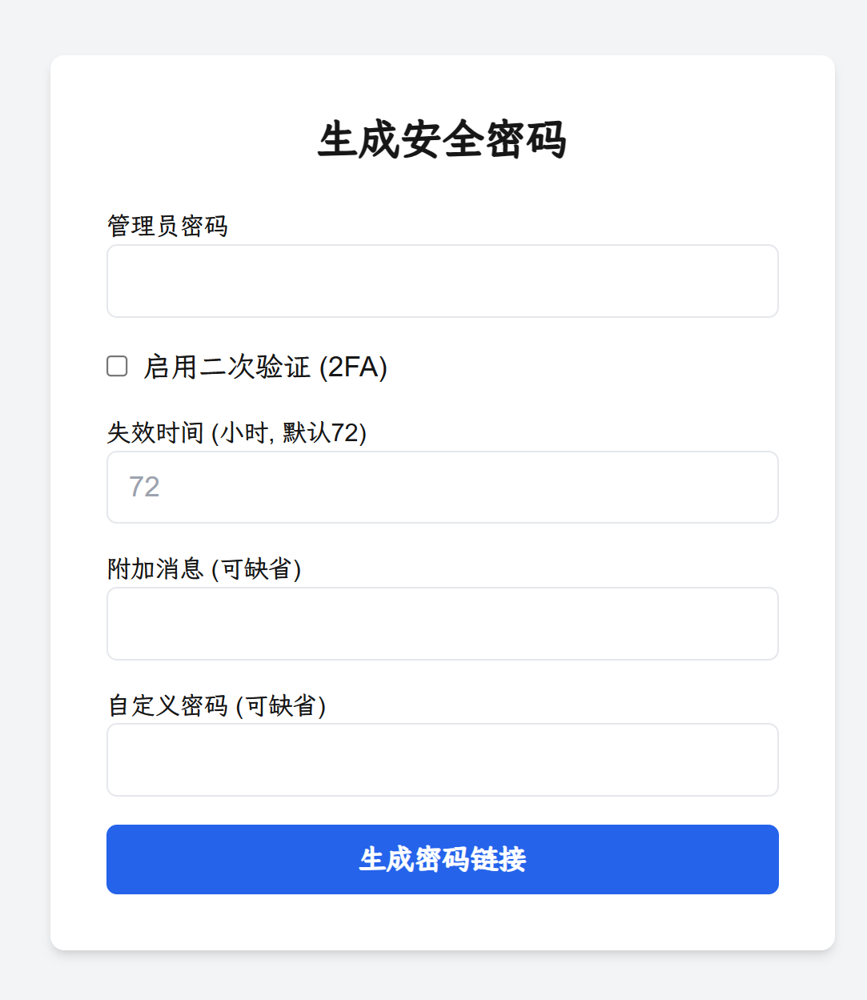
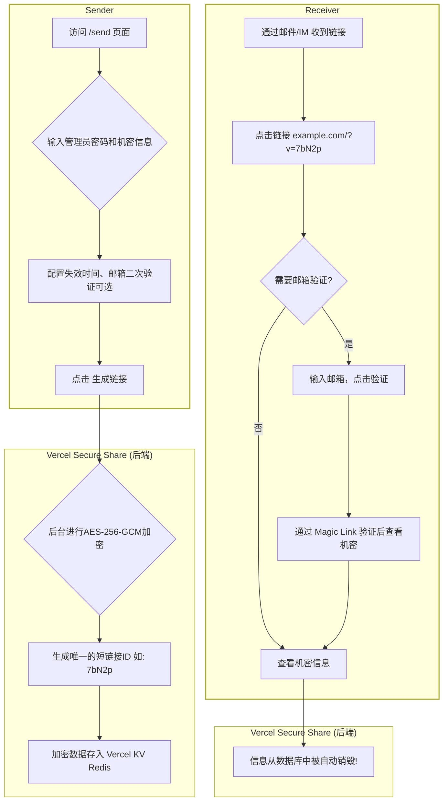
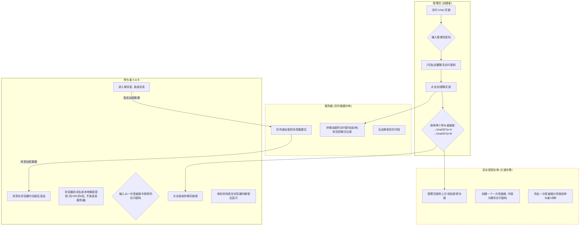

Need English?[](https://github.com/infrost/next-secure-share/blob/master/README.en.md)

# Next Secure Share

如何安全地通过互联网传输密码？同时不让对方有操作成本？这是一个集成了**一次性私密信息分享**与**简易端到端加密聊天**的安全通信平台。通过“阅后即焚”链接和浏览器内加密技术，确保您的敏感信息在送达后即刻销毁，或在私密会话中全程加密（带2FA二次验证与访问审计功能）。服务端和数据库永远无法得知您的传输内容。 **这是一个可以直接免费部署在vercel上的next.js项目。**

[] | (https://nextsecureshare.vercel.app)[](#快速开始一键部署到-vercel)




---

## 为什么选择 Next Secure Share？

你是否曾通过微信、Slack 或邮件发送过密码、API 密钥或服务器登录凭证？这些通信渠道通常会永久保存聊天记录，服务器也可能存储你的明文信息。一旦账号被盗、邮件被截获或服务商数据库泄露，这些敏感信息将面临巨大的安全风险。

**Next Secure Share 解决了这个问题，并提供了两种核心的安全通信方式：**

1.  **一次性链接**: 就像一个数字世界的“阅后即焚”保险箱。你可以将敏感信息放入这个保险箱，生成一个时效链接。你也可以设置“阅后即焚”，接收者通过链接取出信息后，保险箱和里面的信息会立即永久销毁。
2.  **端到端加密聊天室**: 创建一个临时的、完全私密的聊天房间。所有消息在您的浏览器中加密，在对方的浏览器中解密。服务器只传递加密后的乱码，无法窥探任何聊天内容。

### 典型场景

#### 场景一：安全分发一次性密码 (`/send` 模块)

> 你需要将一个加密压缩包的解压密码安全地发送给客户。
> 1.  你通过邮件将**加密的压缩包**发送给客户。
> 2.  你使用 **Next Secure Share** 的**一次性链接**功能，生成一个包含解压密码的链接。
> 3.  你通过另一封邮件或即时消息将这个**安全链接**发给客户。
>
> 客户打开链接查看密码后，该链接立即失效。即使传送链接的邮件被拦截，攻击者也无法再次访问密码。
>
> **安全升级**：假设存在一个能实时监控通信的“中间人”，当他抢先点开链接后，真正的接收者会发现链接已失效，从而立即警觉到信息已泄露。我们的审计系统会记录下每一次访问尝试的 IP 地址，为追踪提供线索。

#### 场景二：开发团队的“紧急生产排障” (`/chat` 模块)

> 你的团队正在处理一个紧急的线上生产环境故障。你需要与另一位远程同事（或临时顾问）协同排查。这个过程涉及到交换临时的服务器SSH凭证、API密钥、查看包含敏感用户数据的日志片段，以及讨论修复方案。
>
> **问题**：使用 Slack、Teams 或微信进行沟通是极度危险的。这些平台的服务器会永久存储你们的聊天记录，包括所有敏感凭证和日志，构成了一个巨大的长期安全隐患。
>
> **解决方案**：
> 1.  **创建安全通道**：你访问自己的 `Next Secure Share` 平台，进入 `/chat` 模块，创建一个带**访问密码**（例如 `ProjectPhoenix-Debug`）的端到端加密聊天室。系统会生成两个参与者链接（A 和 B）。
> 2.  **安全分发“门票”**：你使用 `/send` 模块，将这个聊天室的**访问密码** (`ProjectPhoenix-Debug`) 放入一个“阅后即焚”的链接中。
> 3.  **开始会话**：你通过常规方式（如邮件）将**聊天室链接**和**包含访问密码的一次性链接**同时发给同事。
> 4.  同事先点开一次性链接获取“门票”（访问密码），该链接随即销毁。然后他点击聊天室链接，输入密码，即可进入这个完全私密的会话。
>
> **安全保障**：
> 在这个聊天室里，你们可以放心地交换所有敏感信息。所有消息都在你们各自的浏览器中加密和解密，服务器看到的只是一串串无法破译的乱码。故障排查完毕后，可以手动销毁该聊天室，所有加密记录将从服务器彻底抹去。
>
> **安全升级**：想象一下，即使在你们对话期间，托管 `Next Secure Share` 的服务器被黑客完全攻破。黑客能拿到的也只是聊天室里一堆加密后的消息数据，**他无法解密任何内容**，因为解密的密钥从未离开过你和你同事的浏览器。这便是端到端加密的强大之处。

## 核心功能

*   **双模式安全通信**：同时支持“阅后即焚/二次验证”的一次性信息分享和“E2EE”的端到端加密聊天。
*   **零成本部署**：基于 Vercel 和 Vercel KV 的**免费套餐**，无需任何服务器费用即可拥有自己的私密分享平台。
*   **一次性访问**：分享链接在被访问一次后立即自动销毁，彻底杜绝信息二次泄露的风险。
*   **自定义时效**：可以为每个链接或聊天室设置独立的过期时间，过期后自动清理。
*   **开箱即用**：一键克隆和部署，只需简单配置环境变量即可上线。
*   **多语言支持**：内置简单的英语界面切换，方便国际用户使用。

## 大道至简：专为易用性而设计

我们坚信，最好的安全工具应当是无感的、易于使用的。`Next Secure Share` 在设计的每一个环节都贯彻了简洁易用的原则。

#### 为部署者：轻松拥有，零成本运维
*   **一键部署**：通过 Vercel 的部署按钮，您无需专业的运维知识，在几分钟内即可拥有一个功能完整的专属平台。
*   **零成本启动**：项目完全基于 Vercel 和 Vercel KV (Upstash) 的免费套餐构建，无服务器费用，无数据库开销。
*   **极简配置**：所有配置项均通过标准的环境变量进行管理，逻辑清晰，文档完备。

#### 为使用者：直观操作，用完即走
*   **免注册，无负担**：无论是分享者还是接收者，都无需注册或登录账户，实现了真正的“用完即走”。
*   **直观的流程**：界面设计高度聚焦于核心功能，没有多余的选项干扰，几乎没有学习成本。
*   **清晰的状态反馈**：从链接生成、等待查看到最终销毁，系统都会提供明确的视觉反馈，让用户充满信心。

### ✨ 接收者的“零负担”体验：只需点击链接
在整个安全流程中，信息接收方——那个最需要被保护但往往最缺乏技术背景的用户——自始至终只需要做一个动作：**点击链接。**

这并非偶然，而是一个核心的设计哲学。**我们将所有复杂性都封装在一个简单的链接中**，消除了接收方的所有操作负担。这使得发送者可以毫无顾虑地使用我们的安全方案，因为他们知道对方一定能用、会用。

## 🛡️ 安全模型详解：我们如何保障您的数据安全？

安全是 `Next Secure Share` 的核心。我们采用“纵深防御”和“零信任”原则设计了整个系统。

#### 1. `/send` 模块：一次性链接的“保险箱”模型
*   **数据的“阅后即焚”**：当接收者通过链接访问信息后，该信息会**立即从数据库中被永久删除**，彻底消除后顾之忧。
*   **服务端强加密**：在信息存入数据库的短暂生命周期里，它也使用 `AES-256` 算法在服务端进行了加密。即使数据库被攻破，攻击者拿到的也只是无法打开的“保险箱”。
*   **邮件二次验证 (可选)**：为最高安全级别的场景增加一道验证屏障，确保只有真正的接收者才能查看信息。

#### 2. `/chat` 模块：“零信任”的端到端加密 (E2EE)
*   **端到端加密**：所有聊天消息的加密和解密操作，**完全在您的浏览器（客户端）中进行**。服务器的角色仅仅是一个“盲人邮差”，负责传递它自己也无法识别的加密数据包。
*   **密钥不落地**：聊天室的加解密密钥被存储在 URL 的“哈希”部分（`#`号后面的字符串）。根据 Web 标准，**这部分内容永远不会发送到服务器**，从物理上杜绝了密钥泄露的可能。
*   **安全握手**：我们可以选择利用 `/send` 的阅后即焚功能来安全地分发 `/chat` 聊天室的“门票密码”，解决了 E2EE 中最棘手的初始密钥交换问题，形成了一个完美的安全闭环。
*   **过期自动销毁**：超过预设的时间（默认3天）聊天室没有新增的聊天消息，聊天室会被自动销毁。

#### 3. 平台级通用防护
整个平台还受到中间件主动防御、IP 速率限制和安全审计日志等多层通用安全措施的保护。
我们不仅防御，还记录。系统内置了一套可配置的审计日志功能（默认开启，可在环境变量中关闭），它将关键的安全事件以结构化的形式记录到 Vercel KV 数据库中。这包括：
* **正常访问记录：** 谁（IP）在什么时间访问了哪个链接/聊天室。
* **恶意行为追踪：** 哪个 IP 因为速率超限而被阻止访问。我们设计了* **智能日志去重机制**，对同一 IP 的持续攻击只记录一次，避免日志泛滥。
* **日志自动清理**：所有日志都有预设的生命周期（默认为7天），过期后会自动从数据库中删除，确保在提供安全追溯能力的同时，不永久存储敏感的访问数据。
  
## 快速开始：一键部署到 Vercel

1.  **Fork 本项目**
    > 点击仓库右上角的 "Fork" 按钮，将项目复刻到您自己的 GitHub 账户下。这样做的好处是，当本项目更新时，您可以轻松地将更新同步到您的仓库。

2.  **一键部署到 Vercel**
    > 在您 Fork 后的仓库页面，点击下方的 "Deploy with Vercel" 按钮。

    [](https://vercel.com/new/clone?repository-url=https%3A%2F%2Fgithub.com%2Finfrost%2Fnext-secure-share)

3.  **创建并关联数据库 (Vercel KV)**
    *   在 Vercel 的部署流程中，系统会引导你创建一个 Vercel KV 数据库。
    *   只需点击几下，Vercel 就会自动为你创建数据库，并将其与你的项目关联。关联后，所有必需的 `KV_*` 和 `REDIS_URL` 环境变量**会自动配置好。**

4.  **配置其余环境变量**
    *   在 Vercel 项目的 **Settings -> Environment Variables** 页面，添加下文【环境变量配置】中提到的其他变量（如 `ADMIN_PASSWORD`）。

5.  **重新部署**
    *   配置好所有环境变量后，进入 Vercel 项目的 **Deployments** 标签页，找到最新的部署记录，点击 "Redeploy" 以应用新的环境变量。

6.  **Next Secure Share, 启动！**
    *   访问 `your-domain.com/send` 创建一次性链接。
    *   访问 `your-domain.com/chat` 创建私密聊天室。
    *   **注意**：为了安全，直接访问根域名 `your-domain.com` 会返回 404。

## 环境变量配置

请在 Vercel 项目中添加或在本地开发时创建 `.env.local` 文件来配置以下变量。
**注意：如果不需要邮件二次验证功能，可以不配置 `RESEND_*` 变量，但建议保留这两个字段为空。**

#### `.env.local` 示例
```env
# Vercel KV (Upstash) 会自动提供以下变量，请从 Vercel Storage 标签页复制
KV_URL=...
KV_REST_API_URL=...
KV_REST_API_TOKEN=...
KV_REST_API_READ_ONLY_TOKEN=...
REDIS_URL=...

# 管理员密码 (用于创建链接和聊天室)
ADMIN_PASSWORD="your-super-secret-admin-password"

# AES 加密密钥 (必须是32个字符)
ENCRYPTION_SEED="a_very_strong_32_character_long_secret_key"

# [可选] Resend 配置，仅在需要邮箱二次验证时填写
# 如果不使用resend也建议创建这两个空白变量
RESEND_API_KEY=""
RESEND_FROM_EMAIL=""

# 应用的公开访问地址 (非常重要)
NEXT_PUBLIC_APP_URL="https://your-domain.com"
#如果是本地dev，那应该是http://localhost:3000

# [推荐] 速率限制与日志配置
RATE_LIMIT_ENABLE=true
RATE_LIMIT_COUNT=10
RATE_LIMIT_WINDOW="2 m"
AUDIT_LOG_ENABLE=true
RATE_LIMIT_LOG_TTL=604800 # 日志保留7天 (秒)
```

#### 变量详解

| 变量名 | 说明 | 推荐/默认值 |
| :--- | :--- | :--- |
| `KV_*`, `REDIS_URL` | **[Vercel 自动提供]** 与 Vercel KV (Redis) 数据库相关的连接凭证。 | - |
| `ADMIN_PASSWORD` | 用于访问 `/send` 和 `/chat` 创建页面的管理员密码。**务必设置为强密码**。 | - |
| `ENCRYPTION_SEED` | 用于服务端 AES 加密数据的密钥，**必须是 32 个字符长**。 | - |
| `RESEND_API_KEY` | **[可选]** [Resend](https://resend.com/) 服务的 API Key。 | `""` |
| `RESEND_FROM_EMAIL` | **[可选]** 你在 Resend 上验证过的发件邮箱地址。 | `""` |
| `NEXT_PUBLIC_APP_URL` | 你的应用部署后的公开访问域名，用于生成分享链接。 | `https://your-domain.com` |
| `RATE_LIMIT_ENABLE`| 是否启用速率限制。**强烈建议在生产环境开启**。 | `true` |
| `RATE_LIMIT_COUNT` | 在指定时间窗口内的最大请求次数。 | `10` |
| `RATE_LIMIT_WINDOW`| 速率限制的时间窗口，格式为 `数字 + 空格 + 单位` (`s`, `m`, `h`, `d`)。 | `2 m` |
| `AUDIT_LOG_ENABLE`| 是否启用访问审计日志。 | `true` |
| `RATE_LIMIT_LOG_TTL`| 审计日志在数据库中的保留时间（秒）。 | `604800` |

## 本地部署

1.  **克隆项目到本地**：
    ```bash
    git clone https://github.com/infrost/next-secure-share.git
    cd next-secure-share
    ```

2.  **创建并连接数据库**
    *   在 [Vercel](https://vercel.com) 账户中创建一个 Vercel KV 数据库。
    *   在数据库的 `.env.local` 标签页，复制所有环境变量。

3.  **配置环境变量**：
    *   在项目根目录创建 `.env.local` 文件，粘贴上一步复制的 `KV_*` 变量，并填入其他所有必需的变量（参考上方示例）。

4.  **安装依赖并运行**：
    ```bash
    pnpm install
    pnpm dev
    ```

5.  **访问应用**:
    *   一次性链接创建页: `http://localhost:3000/send`
    *   聊天室创建页: `http://localhost:3000/chat`

## API

本服务提供了一套安全的 API 端点，用于通过编程方式创建和销毁敏感信息链接。所有 API 请求都需要提供有效的 `adminPassword` 进行授权。

### API 根地址

```
https://your-app-domain.com
```
*(请将 `https://your-app-domain.com` 替换为您的实际应用域名。本地测试时，请使用 `http://localhost:3000`)*

---

### 1. 创建安全链接

此端点允许您生成一个新的安全链接。您可以让系统为您生成一个随机密码，也可以使用您自己提供的自定义密码。

*   **端点地址**: `/api/generate`
*   **请求方法**: `POST`
*   **内容类型**: `application/json`

#### 请求体参数

| 参数 | 类型 | 是否必需 | 描述 |
| :--- | :--- | :--- | :--- |
| `adminPassword` | string | **是** | 用于授权请求的管理员密码。 |
| `customPassword`| string | 否 | 为机密信息设置一个自定义密码。如果留空，系统将为您生成一个16位的强随机密码。 |
| `message` | string | 否 | 查看机密信息时向用户显示的可选消息。 |
| `expiry` | string | 否 | 链接的生命周期（单位：小时）。默认为 `72`（3天）。 |
| `burnAfterRead` | boolean | 否 | 如果为 `true`，链接在首次被查看后将立即销毁。默认为 `false`。 |
| `enable2FA` | boolean | 否 | 如果为 `true`，查看机密信息前需要进行邮件验证。默认为 `false`。 |
| `email` | string | 是 (当 `enable2FA` 为 `true` 时) | 用于双因素认证的接收者邮箱地址。 |

#### 示例 1: `curl` - 生成一个由系统提供密码的链接

本示例将创建一个简单的“阅后即焚”链接，并附带一条消息。API 将会自动生成密码并在响应中返回。

```bash
curl --location --request POST 'https://your-app-domain.com/api/generate' \
--header 'Content-Type: application/json' \
--data-raw '{
    "adminPassword": "您的管理员密码",
    "message": "这是用于测试服务器的临时访问令牌。",
    "burnAfterRead": true,
    "expiry": "1"
}'
```

**预期成功响应 (200 OK):**
```json
{
    "url": "https://your-app-domain.com/?v=aBcDe",
    "password": "gE7pL9qR2hK4mN1w" 
}
```

#### 示例 2: Python 脚本 - 创建一个带自定义密码和2FA的链接

此脚本演示了如何创建一个更复杂的链接，它使用预设的密码，并要求接收者在查看前通过邮件进行身份验证。

```python
import requests
import json

# --- 配置 ---
API_URL = "https://your-app-domain.com/api/generate"
ADMIN_PASSWORD = "您的管理员密码"

# --- 请求数据 ---
payload = {
    "adminPassword": ADMIN_PASSWORD,
    "customPassword": "SuperSecretPassword_2025!",
    "message": "凤凰项目 - 生产数据库凭证。",
    "enable2FA": True,
    "email": "dev-ops-team@example.com"
}

# --- 发起 API 调用 ---
try:
    response = requests.post(API_URL, json=payload, timeout=10)
    response.raise_for_status()  # 如果状态码不是 2xx，则会抛出异常
    
    result = response.json()
    
    print("✅ 链接创建成功！")
    print(f"   URL: {result.get('url')}")
    # 因为我们提供了自定义密码，所以响应中不会包含 'password' 字段。
    
except requests.exceptions.HTTPError as e:
    print(f"❌ HTTP 错误: {e.response.status_code}")
    print(f"   响应内容: {e.response.text}")
except requests.exceptions.RequestException as e:
    print(f"❌ 请求失败: {e}")

```

---

### 2. 销毁安全链接 (可选 API)

如果您已经实现了可选的 `/api/destroy` 端点，则可以使用此功能来通过编程方式销毁链接。

*   **端点地址**: `/api/destroy`
*   **请求方法**: `POST`
*   **内容类型**: `application/json`

#### 请求体参数

| 参数 | 类型 | 是否必需 | 描述 |
| :--- | :--- | :--- | :--- |
| `adminPassword` | string | **是** | 用于授权请求的管理员密码。 |
| `id` | string | **是** | 需要销毁的链接的5位唯一ID (即URL中 `v` 参数的值)。 |

#### 示例: `curl` - 销毁一个指定的链接

本示例展示了如何销毁 ID 为 `aBcDe` 的链接。

```bash
curl --location --request POST 'https://your-app-domain.com/api/destroy' \
--header 'Content-Type: application/json' \
--data-raw '{
    "adminPassword": "您的管理员密码",
    "id": "aBcDe"
}'
```

**预期成功响应 (200 OK):**
```json
{
    "message": "Record destroyed."
}
```

#### 示例: Python 脚本 - 使用后清理链接

此脚本演示了一个常见的自动化工作流：创建一个链接，使用它，然后立即将其销毁。

```python
import requests

# (假设前面已有 create_secure_link 函数)

def destroy_secure_link(link_id: str):
    """通过 API 销毁一个安全链接。"""
    API_URL = "https://your-app-domain.com/api/destroy"
    ADMIN_PASSWORD = "您的管理员密码"
    
    payload = {
        "adminPassword": ADMIN_PASSWORD,
        "id": link_id
    }
    try:
        response = requests.post(API_URL, json=payload, timeout=10)
        response.raise_for_status()
        print(f"✅ ID 为 '{link_id}' 的链接已成功销毁。")
        return True
    except requests.exceptions.HTTPError as e:
        print(f"❌ 销毁链接 '{link_id}' 失败: {e.response.text}")
        return False

# --- 工作流演示 ---
if __name__ == "__main__":
    # 1. 创建一个链接
    # creation_result = create_secure_link(message="此链接仅供立即使用和销毁。")
    # 为方便演示，我们假设已成功创建链接并获得了其ID
    creation_result = {'url': 'https://your-app-domain.com/?v=xYz12'}
    
    if creation_result:
        link_url = creation_result.get('url')
        link_id = link_url.split('v=')[-1]
        
        print(f"链接已创建，ID: {link_id}")
        
        # 2. 模拟使用这个机密信息 (例如，在CI/CD任务中)
        print("...模拟使用机密信息中...")
        
        # 3. 销毁链接
        destroy_secure_link(link_id)
```

## 技术栈

*   **框架**: Next.js 14+ (App Router/Server Action)
*   **UI**: Tailwind CSS
*   **数据库**: Redis (Vercel KV via Upstash)
*   **加密**: Node.js `crypto` (AES-256), Web Crypto API
*   **邮件服务**: Resend
*   **部署**: Vercel (Serverless, Edge Middleware)

## 工作流程

### (一) 阅后即焚链接

此流程用于安全地单次传递信息。



### (二) 端到端加密聊天

此流程确保只有对话双方能看到消息内容，实现了真正的端到端加密。



---
如需详细 API 或代码说明，请查阅源码或提交 Issue。

**多语言翻译的隐私提示：** 本项目的多语言功能是通过 Google Translate Element 实现的。当您切换到非默认语言时，页面上的文本内容可能会被发送给 Google 的服务器进行翻译。如果您处理的是最高级别的敏感信息，建议保持使用默认语言以避免此环节。
