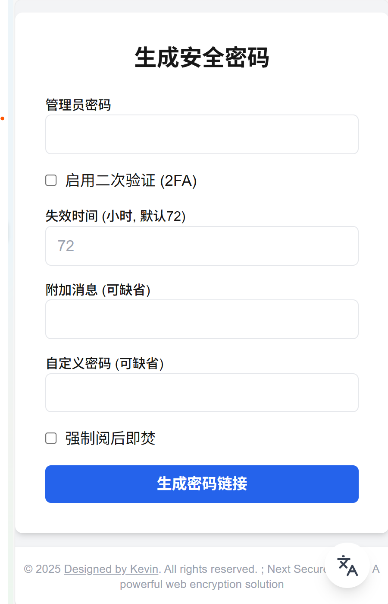

# Next Secure Share

一个安全、私密、一次性的密码与机密信息共享平台。通过端到端加密的一次性链接，确保你的敏感信息在送达后即刻销毁。

[](https://vercel.com/new/clone?repository-url=https%3A%2F%2Fgithub.com%2Finfrost%2Fnext-secure-share)

（请参考下面部署说明）



---

## 为什么需要 Next Secure Share？

你是否曾通过微信、Slack 或邮件发送过密码、API 密钥或服务器登录凭证？这些通信渠道通常会永久保存聊天记录，服务器也可能存储你的明文信息。一旦账号被盗、邮件被截获或服务商数据库泄露，这些敏感信息将面临巨大的安全风险。

**Next Secure Share 解决了这个问题。**

它就像一个数字世界的“阅后即焚”保险箱。你可以将敏感信息放入这个保险箱，生成一个一次性链接。接收者通过链接取出信息后，保险箱和里面的信息会立即永久销毁。即使传送链接的邮件或消息被第三方看到，他们也无法再次访问，从而确保了信息的绝对安全。

**典型场景：**
> 你需要将一个加密压缩包的解压密码发送给客户。
> 1.  你通过邮件将**加密的压缩包**发送给客户。
> 2.  你使用 **Next Secure Share** 生成一个包含解压密码的**一次性安全链接**。
> 3.  你通过另一封邮件或即时消息将这个**安全链接**发给客户。

这样，文件和密钥被完全分离，即使邮件被拦截，攻击者也无法同时获得文件和密码。

## 核心功能

*   **零成本部署**：基于 Vercel 和 Vercel KV 的**免费套餐**，无需任何服务器费用即可拥有自己的私密分享平台。(Resend 发件服务同样是免费的)
*   **一次性访问**：链接在被访问一次后立即自动销毁，彻底杜绝信息二次泄露的风险。
*   **自定义时效**：可以为每个链接设置独立的过期时间（默认为3天），过期后自动清理。
*   **附加消息**：可以递送附加的消息或自定义密码，同样是加密的。
*   **开箱即用**：一键克隆和部署，只需简单配置环境变量即可上线。

### 安全特性
*   **端到端加密**：密码和信息在存储到数据库前，都使用 `AES-256-GCM` 算法在服务端进行加密。即使数据库被攻破，数据本身也是加密的。
*   **邮件二次验证 (可选)**：为最高安全级别的场景增加一道额外的验证屏障，确保只有指定收件人可以访问。
*   **速率限制**：内置针对管理员入口和访客链接的速率限制，有效防止暴力破解和恶意请求。
*   **Edge Middleware 防护**：在请求到达核心应用逻辑之前，拦截并拒绝所有无效请求，提升安全性和性能。

## 快速开始

1.  **点击下方按钮将其部署到您的vercel账号上**
[](https://vercel.com/new/clone?repository-url=https%3A%2F%2Fgithub.com%2Finfrost%2Fnext-secure-share)

更推荐fork到您的仓库再部署，这样就能通过GitHub action获得项目的自动更新了。

2. **创建数据库 (Vercel KV)**
    *   访问 Vercel Marketplace 的 [Upstash for Redis](https://vercel.com/marketplace/upstash) 页面。
    *   点击 **Install** 并选择你的 Vercel 账户。
    *   创建一个新的 Redis 数据库。
    *   创建后，进入 Vercel 项目的 **Storage** 标签页，将刚创建的数据库与你的项目关联起来。

3. **配置环境变量**：
    *   Vercel部署：在关联数据库后，Vercel **会自动为你生成** `KV_*` 和 `REDIS_URL` 等变量。
    *   您可以去`Resend.com`免费配置一个发件API，用于该项目的自动发件。
    *   下文提到的其他变量，也要一起添加到 Vercel 项目的 **Settings -> Environment Variables** 中。
  
4. **重新部署**
    *   配置好环境变量后，重新部署您的项目

5. **Next Secure Share, 启动！**
   访问 `yourdomain.com/send` 
   **注意！** 为了安全，主域名之间访问是返回404的，路径是`项目地址/send`!


## 环境变量配置

请在 Vercel 项目中添加或在 `.env.local` 文件中配置以下变量。
**注意：不需要二次验证则可以不配置resend，但是需要保留resend的两个环境变量字段！**

#### `.env.local` 示例
```env
# Vercel KV (Upstash) 会自动提供以下变量，请从 Vercel Storage 标签页复制
KV_URL=...
KV_REST_API_URL=...
KV_REST_API_TOKEN=...
KV_REST_API_READ_ONLY_TOKEN=...
REDIS_URL=...

# 管理员密码
ADMIN_PASSWORD="your-super-secret-admin-password"

# AES 加密密钥 (必须是32个字符)
ENCRYPTION_SEED="e1657dc2ec35b122269fb8b87a8uaa0c"

# [可选] Resend 配置，仅在需要邮箱二次验证时填写
RESEND_API_KEY="re_xxxxx"
RESEND_FROM_EMAIL="your@email.com"

# 应用的公开访问地址
NEXT_PUBLIC_APP_URL="http://localhost:3000"

# [推荐] 速率限制配置
RATE_LIMIT_ENABLE=true
RATE_LIMIT_COUNT=10
RATE_LIMIT_WINDOW=2 m
```

#### 变量详解

| 变量名 | 说明 |
| :--- | :--- |
| `KV_*`, `REDIS_URL` | **[Vercel 自动提供]** 与 Vercel KV (Redis) 数据库相关的连接凭证。 |
| `ADMIN_PASSWORD` | 用于访问 `/send` 页面的管理员密码，请务必设置为强密码。 |
| `ENCRYPTION_SEED` | 用于 AES 加密数据的密钥，**必须是 32 个字符长**。 |
| `RESEND_API_KEY` | **[可选]** [Resend](https://resend.com/) 服务的 API Key。 |
| `RESEND_FROM_EMAIL` | **[可选]** 你在 Resend 上验证过的发件邮箱地址。 |
| `NEXT_PUBLIC_APP_URL` | 你的应用部署后的公开访问域名，用于生成分享链接。 |
| `RATE_LIMIT_ENABLE` | 是否启用速率限制 (`true` 或 `false`)。**强烈建议生产环境开启**。 |
| `RATE_LIMIT_COUNT` | 在指定时间窗口内的最大请求次数。 |
| `RATE_LIMIT_WINDOW` | 速率限制的时间窗口，格式为 `数字 + 空格 + 单位` (`s`, `m`, `h`, `d`)。 |

## 本地部署

1.  **克隆项目到本地**：
    ```bash
    git clone https://github.com/infrost/next-secure-share.git
    cd next-secure-share
    ```

2.  **创建数据库 (Vercel KV)**
    *   访问 Vercel Marketplace 的 [Upstash for Redis](https://vercel.com/marketplace/upstash) 页面。
    *   点击 **Install** 并选择你的 Vercel 账户。
    *   创建一个新的 Redis 数据库。
    *   创建后，进入数据库配置页复制`Vercel KV`的`ENV环境变量`

3.  **配置环境变量**：
    *   对于本地开发，参考上面的示例，创建 `.env.local` 并填入所有值。

4.  **安装依赖并运行**：
    ```bash
    pnpm install
    pnpm dev
    ```

5. **Secure Share, 启动！**
   访问 `yourdomain.com/send` 
   （本地则通常为localhost:3000/send）

## 技术栈

*   **框架**: Next.js 14+ (App Router)
*   **UI**: Tailwind CSS
*   **数据库**: Redis (Vercel KV via Upstash)
*   **加密**: Node.js `crypto` (AES-256-GCM)
*   **邮件服务**: Resend
*   **部署**: Vercel

## 工作流程


---
如需详细 API 或代码说明，请查阅源码或提交 Issue。

